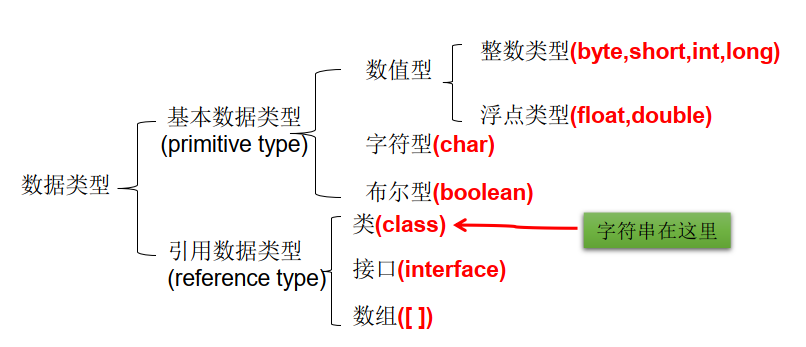
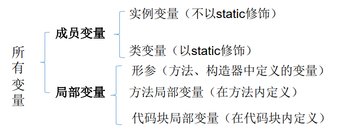
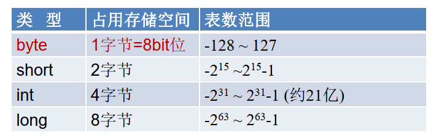
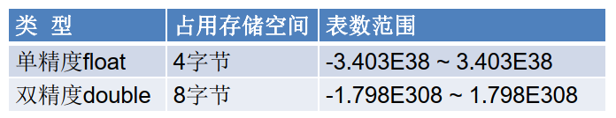
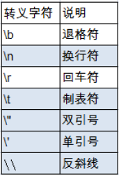
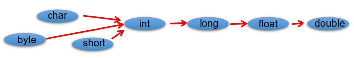

### 变量的分类：按数据类型

- 对于每一种数据都定义了明确的具体数据类型（强类型语言），在内存中分
    配了不同大小的内存空间

- 在方法体外，类体内声明的变量称为`成员`变量
- 在方法体内部声明的变量称为`局部`变量

### 整数类型：byte、short、int、long

- java 的整型常量默认为 int 型，声明 long 型常量须后加 ‘l’ 或 ‘L’ 
- java 程序中变量通常声明为 int 型，除非不足以表示较大的数，才使用 long

### 浮点类型：float、double

- float: 单精度，尾数可以精确到7位有效数字。很多情况下，精度很难满足需求
- double: 双精度，精度是 float 的两倍。通常采用此类型
- Java 的浮点型常量默认为 double 型，声明 float 型常量，须后加‘f’或‘F’

### 字符类型：char

- char 型数据用来表示通常意义上“字符”(2字节)

- Java 中的所有字符都使用 Unicode 编码，故一个字符可以存储一个字母，一个汉字，或其他书面语的一个字符

- 字符型变量的三种表现形式：

    - 字符常量是用单引号(‘ ’)括起来的单个字符。例如：char c1 = 'a';   char c2 
        = '中'; char c3 =  '9';

    - Java中还允许使用转义字符‘\’来将其后的字符转变为特殊字符型常量。
        例如：char c3 = ‘\n’;  '\n'表示换行符

    - 直接使用 Unicode 值来表示字符型常量：‘\uXXXX’。其中，XXXX代表
        一个十六进制整数。如：\u000a 表示 \n

        

- char类型是可以进行运算的。因为它都对应有Unicode码

### 布尔类型：boolean

- boolean类型数据只允许取值 true 和 false，无 null
    - 不可以使用 0 或非 0 的整数替代false和true，这点和C语言不同
    - ava虚拟机中没有任何供 boolean 值专用的字节码指令，Java 语言表达所操作的 boolean 值，在编译之后都使用 java 虚拟机中的 int 数据类型来代替：true 用 1 表示，false 用 0 表示。———《java虚拟机规范 8版》

### 基本数据类型转换

- 自动类型转换：容量小的类型自动转换为容量大的数据类型。数据类型按容
    量大小排序为：

    

- 有多种类型的数据混合运算时，系统首先自动将所有数据转换成容量最大的
    那种数据类型，然后再进行计算

- byte、short、char 之间不会相互转换，他们三者在计算时首先转换为 int 类型

- boolean类型不能与其它数据类型运算

- 当把任何基本数据类型的值和字符串(String)进行连接运算时(+)，基本数据类
    型的值将自动转化为字符串(String)类型

### 强制类型转换

- 自动类型转换的逆过程，将容量大的数据类型转换为容量小的数据类型。使用时要加上强制转换符：()，但可能造成精度降低或溢出，格外要注意
- 通常，字符串不能直接转换为基本类型，但通过基本类型对应的包装类则可以实现把字符串转换成基本类型
    - 如： String a = “43”; int i = Integer.parseInt(a)；
    - boolean类型不可以转换为其它的数据类型

