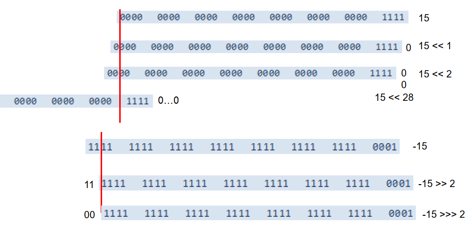
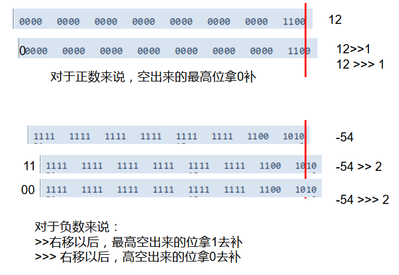
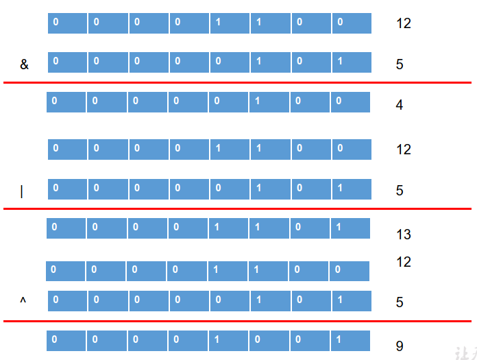
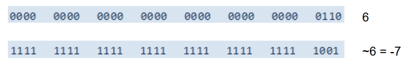
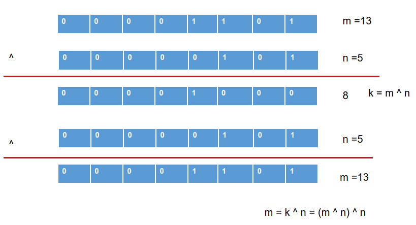
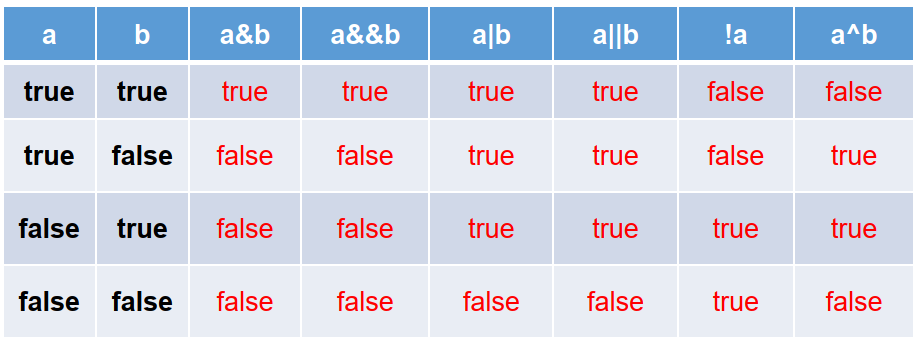
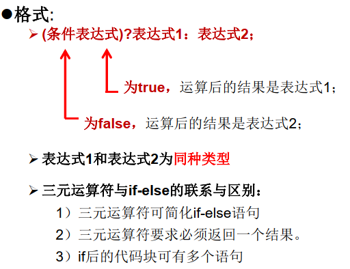
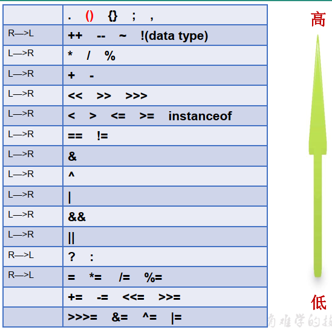

### 位运算符

| 符号 | 说明                                                         |
| ---- | ------------------------------------------------------------ |
| <<   | 空位补0，被移除的高位丢弃，空缺位补0。                       |
| >>   | 被移位的二进制最高位是0，右移后，空缺位补0；最高位是1，空缺位补1。 |
| >>>  | 被移位二进制最高位无论是0或者是1，空缺位都用0补。            |
| &    | 二进制位进行与运算，只有1&1时结果是1，否则是0;               |
| \|   | 二进制位进行或运算，只有0\|0时结果是0，否则是1;              |
| ^    | 相同二进制位进行异或运算，结果是0；1^1=0 , 0^0=0； 不相同二进制位 ^ 运算结果是1。1^0=1 , 0^1=1。 |
| ~    | 正数取反，各二进制码按补码各位取反 负数取反，各二进制码按补码各位取反 |

位运算是直接对整数的二进制进行的运算

#### &  |  ^  ~

### 逻辑运算符

- & 逻辑与
- | 逻辑或 
- ！逻辑非
- && 短路与 
- || 短路或 
- ^ 逻辑异或

- “&”和“&&”的区别：
    - 单&时，左边无论真假，右边都进行运算；
    - 双&时，如果左边为真，右边参与运算，如果左边为假，那么右边不参与运算。
- “|”和“||”的区别同理，||表示：当左边为真，右边不参与运算。
- 异或( ^ )与或( | )的不同之处是：当左右都为true时，结果为false。
    - 理解：异或，追求的是“异”!

### 三元运算符

### 运算符的优先级

只有单目运算符、三元运算符、赋值运算符是从右向左运算的。

