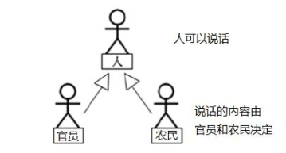

随着继承层次中一个个新子类的定义，类变得越来越具体，而父类则更一般，更通用。类的设计应该保证父类和子类能够共享特征。有时将一个父类设计得非常抽象，以至于它没有具体的实例，这样的类叫做抽象类。

- 用abstract关键字来修饰一个类，这个类叫做抽象类。
- 用abstract来修饰一个方法，该方法叫做抽象方法。
- 抽象方法：只有方法的声明，没有方法的实现。以分号结束：
    - 比如：public abstract void talk();
- 含有抽象方法的类必须被声明为抽象类。
- 抽象类不能被实例化。抽象类是用来被继承的，抽象类的子类必须重写父类的抽象方法，并提供方法体。若没有重写全部的抽象方法，仍为抽象类。
- ==不能用abstract修饰变量、代码块、构造器；==
- ==不能用abstract修饰私有方法、静态方法、final的方法、final的类。==

含有抽象方法的类必须被声明为抽象类。
 抽象类不能被实例化。抽象类是用来被继承的，抽象类的子类必须重
写父类的抽象方法，并提供方法体。若没有重写全部的抽象方法，仍
为抽象类。
 不能用abstract修饰变量、代码块、构造器；
 不能用abstract修饰私有方法、静态方法、final的方法、final的类。