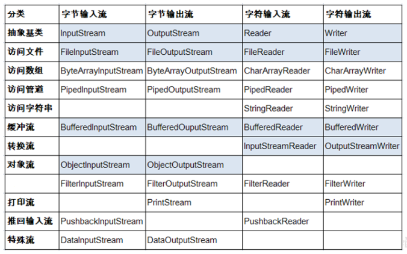
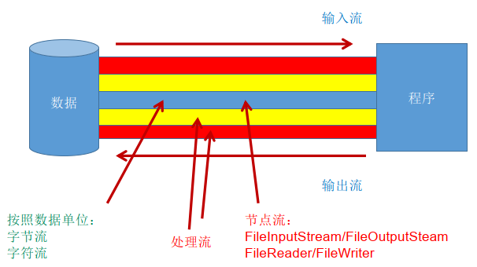
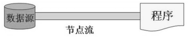
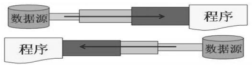
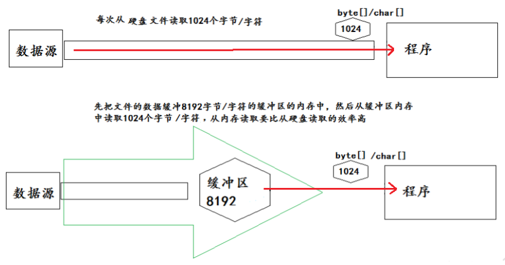
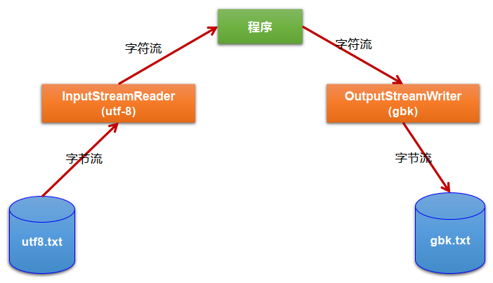

### 1.流的分类

- 按操作数据单位不同分为：字节流(8 bit)，字符流(16 bit)。
- 按数据流的流向不同分为：输入流，输出流。
- 按流的角色的不同分为：节点流，处理流。

| 抽象基类 | 字节流       | 字符流 |
| -------- | ------------ | ------ |
| 输入流   | InputStream  | Reader |
| 输出流   | OutputStream | Writer |

### IO 流体系

### 2.节点流和处理流

节点流：直接从数据源或目的地读写数据。

处理流：不直接连接到数据源或目的地，而是“连接”在已存在的流（节点流或处理流）之上，通过对数据的处理为程序提供更为强大的读写功能。

### 3.处理流之一：缓冲流

### 4.处理流之二：转换流

